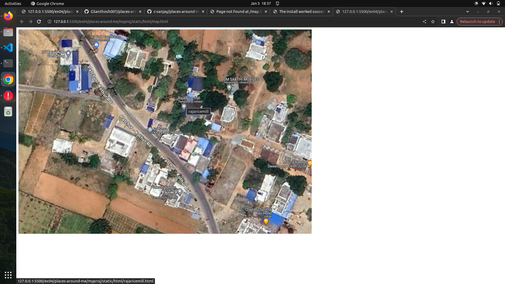
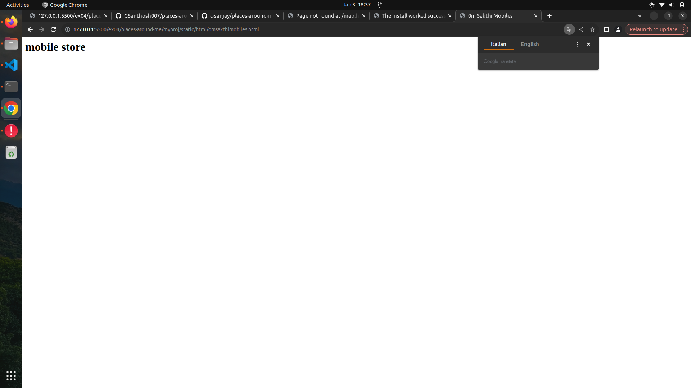
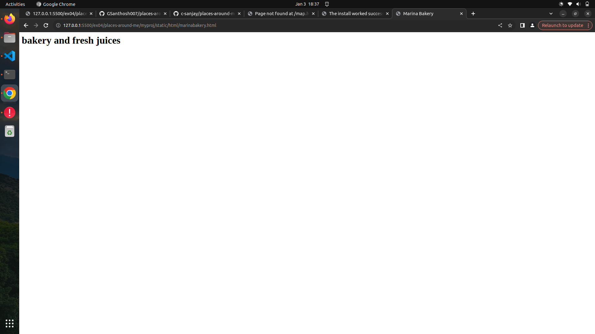
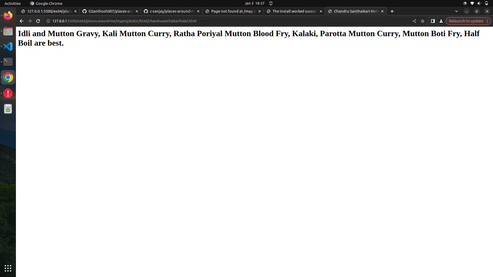
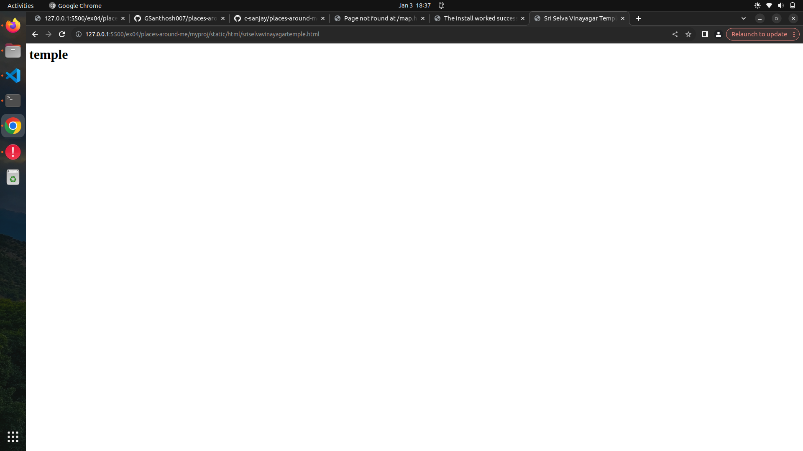

### Places Around Me
AIM:
To develop a website to display details about the places around my house.

Design Steps:
### Step 1:
Clone the github repository into the IDE

### Step 2:
Create a django project

### step 3:
Write the needed HTML code

### step 4:
Run the django server and excute the HTML files


## Code:
map.html
```html

<map name="image_map">
  <area alt="sriselvavinayagartemple" title=" sriselvavinayagartemple " href="sriselvavinayagartemple.html" coords="481,355,525,403" shape="rect">
  <area alt="rajaricemill" title="rajaricemill " href="rajaricemill.html" coords="617,278,646,318" shape="rect">
  <area alt="omsakthimobiles" title=" omsakthimobiles" href="omsakthimobiles.html" coords="790,205,812,231" shape="rect">
  <area alt="chandrusanthaikarihotel" title="chandrusanthaikarihotel" href="chandrusanthaikarihotel.html" coords="926,715,957,748" shape="rect">
  <area alt="marinabakery" title="marinabakery" href="marinabakery.html" coords="1092,496,1112,523" shape="rect">
</map>

```
marinabakery
```html
<html>
<head>
<title>Marina Bakery</title>
</head>
<h1>
<font color="black">
   bakery and fresh juices
</font>  
</h1>
</html>
```
omsakthimobiles
```html
<html>
<head>
<title>0m Sakthi Mobiles</title>
</head>
<h1>
<font color="black">
   mobile store
</font>  
</h1>
</html>
```
rajaricemill
```html
<html>
<head>
<title>Raja Rice Mill</title>
</head>
<h1>
<font color="black">
   rice mill
</font>  
</h1>
</html>
```
sriselvavinayagartemple 
```html
<html>
<head>
<title>Sri Selva Vinayagar Temple</title>
</head>
<h1>
<font color="black">
   temple
</font>  
</h1>
</html>
```
chandrusanthaikarihotel
```html
<html>
<head>
<title>Chandru Santhaikari Hotel</title>
</head>
<h1>
<font color="black">
    Idli and Mutton Gravy, Kali Mutton Curry, Ratha Poriyal Mutton Blood Fry,
     Kalaki, Parotta Mutton Curry, Mutton Boti Fry, Half Boil are best.
</font>  
</h1>
</html>
```
## Output:







## Result:
successfully exectued